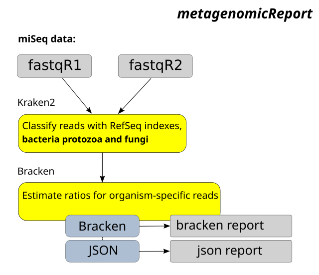

# metagenomicReport

A workflow for checking Fastq files for possible contamination with reads from species other than human, primarily cell culture samples

## Overview



## Dependencies

* [kraken2 2.0.8](https://ccb.jhu.edu/software/bracken/index.shtml)
* [bracken 2.7](https://ccb.jhu.edu/software/bracken/index.shtml)


## Usage

### Cromwell
```
java -jar cromwell.jar run metagenomicReport.wdl --inputs inputs.json
```

### Inputs

#### Required workflow parameters:
Parameter|Value|Description
---|---|---
`fastqR1`|File|Fastq R1
`fastqR2`|File|Fastq R2
`outputPrefix`|String|Output is, usually sample name

#### Optional task parameters:
Parameter|Value|Default|Description
---|---|---|---
`krakenReport.modules`|String|"kraken2/2.0.8 kraken2-pluspf-database/1"|Names and versions of modules needed for read classification
`krakenReport.krakenDb`|String|"$KRAKEN2_PLUSPF_DATABASE_ROOT/"|Path to bracken/kraken db
`krakenReport.timeout`|Int|24|Timeout in hours for this task
`krakenReport.jobMemory`|Int|20|Java memory for Kraken
`brackenReport.modules`|String|"bracken/2.7 kraken2-pluspf-database/1"|Names and versions of modules needed for read ratio estimation
`brackenReport.krakenDb`|String|"$KRAKEN2_PLUSPF_DATABASE_ROOT/"|Path to bracken/kraken db
`brackenReport.classLevel`|String|"S"|Classification level, default S (species)
`brackenReport.readLength`|Int|100|Expected read length
`brackenReport.threshold`|Int|10|minimum number of reads required for a classification
`brackenReport.timeout`|Int|24|Timeout in hours for this task
`brackenReport.jobMemory`|Int|20|Java memory for Bracken
`brackenReport.minRatio`|Float|0.03|Threshold for reporting species, minimum read proportion in the analyzed sample


### Outputs

Output | Type | Description
---|---|---
`textReport`|File|text file generated by Bracken
`jsonReport`|File|json report with bracken-collected estimates


## Support

For support, please file an issue on the [Github project](https://github.com/oicr-gsi) or send an email to gsi@oicr.on.ca .

_Generated with generate-markdown-readme (https://github.com/oicr-gsi/gsi-wdl-tools/)_
